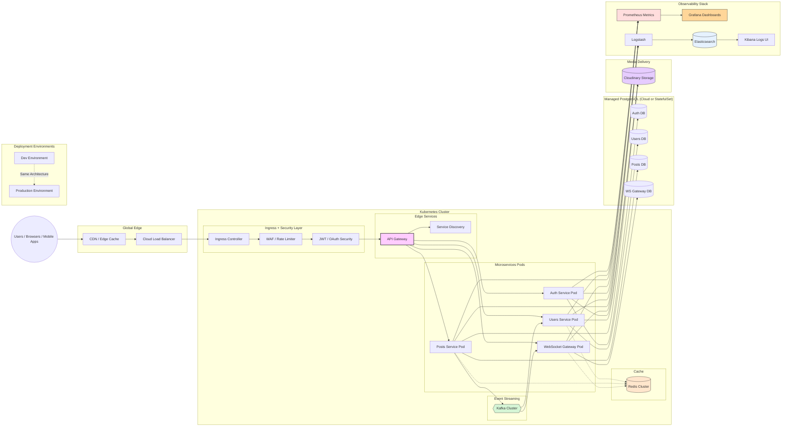

# next design

```mermaid

flowchart LR

%% ================= USERS =================
User((Users / Browsers / Mobile Apps))

%% ================= GLOBAL EDGE =================
subgraph GLOBAL_EDGE["Global Edge"]
    CDN[CDN / Edge Cache]
    LB[Cloud Load Balancer]
end

User --> CDN
CDN --> LB

%% ================= K8S CLUSTER =================
subgraph K8S["Kubernetes Cluster"]

    %% ---------- INGRESS ----------
    subgraph INGRESS["Ingress + Security Layer"]
        Ingress[Ingress Controller]
        WAF[WAF / Rate Limiter]
        AuthLayer[JWT / OAuth Security]
    end

    LB --> Ingress
    Ingress --> WAF
    WAF --> AuthLayer

    %% ---------- EDGE SERVICES ----------
    subgraph EDGE["Edge Services"]
        Gateway[API Gateway]
        Eureka[Service Discovery]
    end

    AuthLayer --> Gateway
    Gateway --> Eureka

    %% ---------- CORE MICROSERVICES ----------
    subgraph SERVICES["Microservices Pods"]
        AuthService[Auth Service Pod]
        UserService[Users Service Pod]
        PostService[Posts Service Pod]
        WSGateway[WebSocket Gateway Pod]
    end

    Gateway --> AuthService
    Gateway --> UserService
    Gateway --> PostService
    Gateway --> WSGateway

    %% ---------- CACHE ----------
    subgraph CACHE["Cache"]
        Redis[(Redis Cluster)]
    end

    UserService -.-> Redis
    PostService -.-> Redis
    WSGateway -.-> Redis

    %% ---------- EVENT STREAM ----------
    subgraph EVENTS["Event Streaming"]
        Kafka{{Kafka Cluster}}
    end

    PostService --> Kafka
    Kafka --> UserService
    Kafka --> WSGateway

end

%% ================= DATABASE LAYER =================
subgraph DATABASES["Managed PostgreSQL (Cloud or StatefulSet)"]
    AuthDB[(Auth DB)]
    UserDB[(Users DB)]
    PostDB[(Posts DB)]
    WSDB[(WS Gateway DB)]
end

AuthService --> AuthDB
UserService --> UserDB
PostService --> PostDB
WSGateway --> WSDB

%% ================= MEDIA STORAGE =================
subgraph MEDIA["Media Delivery"]
    Cloudinary[(Cloudinary Storage)]
end

AuthService --> Cloudinary
UserService --> Cloudinary
PostService --> Cloudinary

%% ================= OBSERVABILITY =================
subgraph OBS["Observability Stack"]
    Prometheus[Prometheus Metrics]
    Grafana[Grafana Dashboards]
    Logstash[Logstash]
    Elastic[(Elasticsearch)]
    Kibana[Kibana Logs UI]
end

AuthService --> Prometheus
UserService --> Prometheus
PostService --> Prometheus
WSGateway --> Prometheus

AuthService --> Logstash
UserService --> Logstash
PostService --> Logstash
WSGateway --> Logstash

Logstash --> Elastic
Elastic --> Kibana
Prometheus --> Grafana

%% ================= ENVIRONMENTS =================
subgraph ENV["Deployment Environments"]
    Dev[Dev Environment]
    Prod[Production Environment]
end

Dev -. Same Architecture .-> Prod

%% ================= STYLES =================
style Gateway fill:#ffccff,stroke:#333,stroke-width:2px
style Kafka fill:#d5f5d5,stroke:#333
style Redis fill:#ffe6cc,stroke:#333
style Cloudinary fill:#e6ccff,stroke:#333
style Prometheus fill:#ffdddd,stroke:#333
style Grafana fill:#ffd699,stroke:#333
style Elastic fill:#e6f2ff,stroke:#333

```
