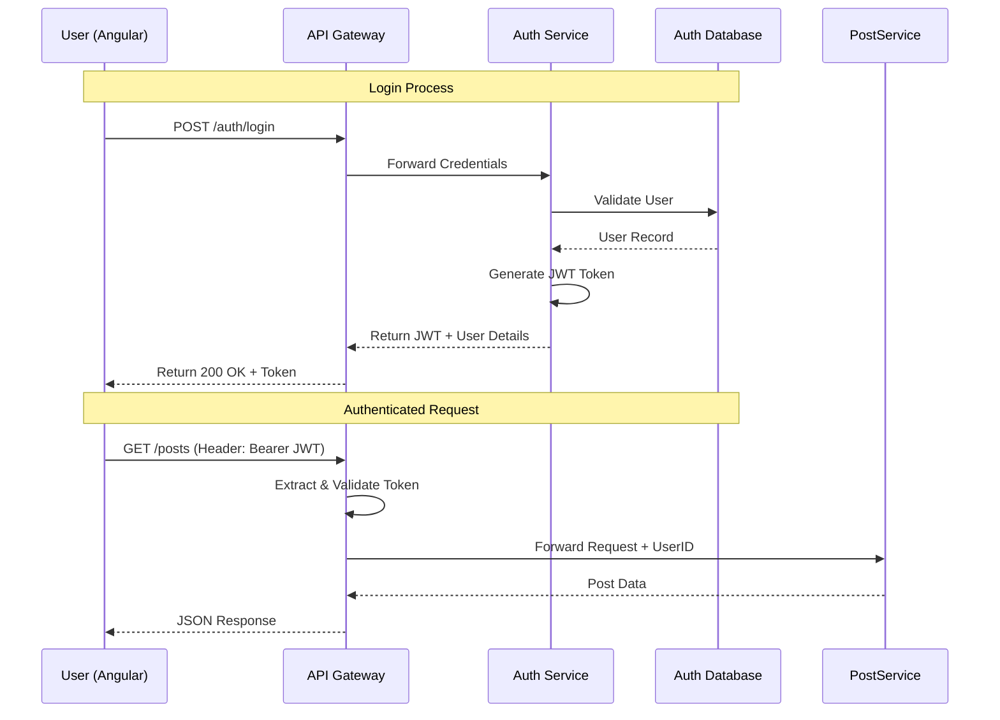

# Sequence Diagrams

## 🔐 Distributed Authentication Flow

This diagram explains how a user logs in and how the API Gateway validates subsequent requests using the Auth Service.

```mermaid
sequenceDiagram
    participant U as User (Angular)
    participant G as API Gateway
    participant A as Auth Service
    participant DB as Auth Database

    Note over U, DB: Login Process
    U->>G: POST /auth/login
    G->>A: Forward Credentials
    A->>DB: Validate User
    DB-->>A: User Record
    A->>A: Generate JWT Token
    A-->>G: Return JWT + User Details
    G-->>U: Return 200 OK + Token

    Note over U, DB: Authenticated Request
    U->>G: GET /posts (Header: Bearer JWT)
    G->>G: Extract & Validate Token
    G->>PostService: Forward Request + UserID
    PostService-->>G: Post Data
    G-->>U: JSON Response

```
