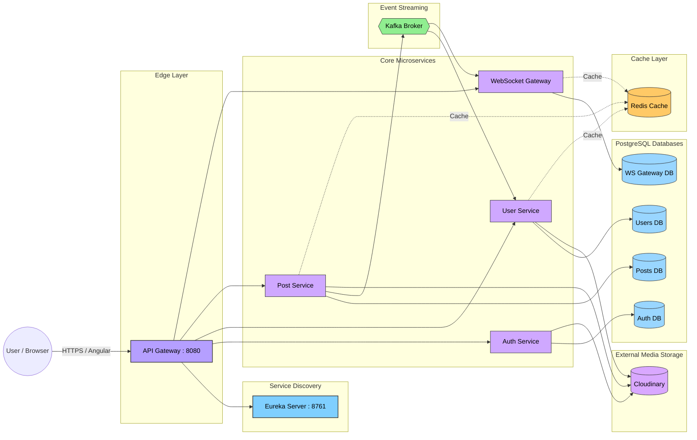

# System Design & Architecture

Wordium follows a **Microservices Architecture** to ensure high availability, scalability, and independent deployment cycles.

## 🗺️ High-Level Component Map

```mermaid

flowchart LR
    %% ================= EDGE =================
    subgraph EDGE["Edge Layer"]
        Gateway["API Gateway : 8080"]
    end

    %% ================= DISCOVERY =================
    subgraph DISCOVERY["Service Discovery"]
        Eureka["Eureka Server : 8761"]
    end

    %% ================= CORE SERVICES =================
    subgraph SERVICES["Core Microservices"]
        AuthService["Auth Service"]
        UserService["User Service"]
        PostService["Post Service"]
        WSGateway["WebSocket Gateway"]
    end

    %% ================= DATABASES =================
    subgraph DATABASES["PostgreSQL Databases"]
        AuthDB[("Auth DB")]
        UserDB[("Users DB")]
        PostDB[("Posts DB")]
        WSDB[("WS Gateway DB")]
    end

    %% ================= CACHE =================
    subgraph CACHE["Cache Layer"]
        Redis[("Redis Cache")]
    end

    %% ================= EVENT STREAM =================
    subgraph EVENTS["Event Streaming"]
        Kafka{{"Kafka Broker"}}
    end

    %% ================= EXTERNAL STORAGE =================
    subgraph EXTERNAL["External Media Storage"]
        Cloudinary[("Cloudinary")]
    end

    %% ================= FLOW =================
    User(("User / Browser")) -- HTTPS / Angular --> Gateway
    Gateway --> Eureka
    Gateway --> AuthService
    Gateway --> UserService
    Gateway --> PostService
    Gateway --> WSGateway

    AuthService --> AuthDB
    AuthService --> Cloudinary

    UserService --> UserDB
    UserService --> Cloudinary

    PostService --> PostDB
    PostService --> Kafka
    PostService --> Cloudinary

    WSGateway --> WSDB

    UserService -. Cache .-> Redis
    WSGateway -. Cache .-> Redis
    PostService -. Cache .-> Redis

    Kafka --> UserService
    Kafka --> WSGateway

    %% ================= STYLES =================
    style Gateway fill:#b59fff,stroke:#333,stroke-width:1.5px,color:#000
    style Eureka fill:#7fcfff,stroke:#333,stroke-width:1.5px,color:#000
    style AuthService fill:#cfa8ff,stroke:#333,stroke-width:1px,color:#000
    style UserService fill:#cfa8ff,stroke:#333,stroke-width:1px,color:#000
    style PostService fill:#cfa8ff,stroke:#333,stroke-width:1px,color:#000
    style WSGateway fill:#cfa8ff,stroke:#333,stroke-width:1px,color:#000
    style AuthDB fill:#99d6ff,stroke:#333,stroke-width:1px,color:#000
    style UserDB fill:#99d6ff,stroke:#333,stroke-width:1px,color:#000
    style PostDB fill:#99d6ff,stroke:#333,stroke-width:1px,color:#000
    style WSDB fill:#99d6ff,stroke:#333,stroke-width:1px,color:#000
    style Redis fill:#ffc966,stroke:#333,stroke-width:1px,color:#000
    style Kafka fill:#90ee90,stroke:#333,stroke-width:1px,color:#000
    style Cloudinary fill:#d9a8ff,stroke:#333,stroke-width:1px,color:#000

```
