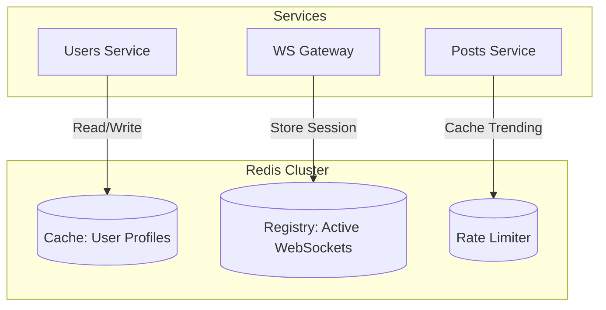

# ⚡ High-Performance Caching: Redis

Wordium utilizes **Redis 7** as a distributed, in-memory data store. In our microservices ecosystem, Redis serves two critical purposes: **Performance Optimization (Caching)** and **Real-time Session Management**.

## 🧠 Why Redis? (Architectural Decisions)

In a microservices environment, database calls across network boundaries are expensive. We implement Redis to:

1. **Reduce Database Load:** By caching frequently accessed data (like User Profiles), we reduce the read pressure on PostgreSQL.
2. **Distributed State:** Since services like `wsgateway` and `users-service` are replicated, Redis provides a shared "source of truth" for temporary data that all instances can access.
3. **Real-time Speed:** With sub-millisecond latency, Redis is the backbone of our WebSocket session tracking.

---

## 🏗️ Redis Role in Wordium



---

## 🛠️ Implementation Details

### 1. User Profile Caching (`users-service`)

To avoid hitting the `psql_users_db` on every request, we use the **Cache-Aside Pattern**:

- **Key Pattern:** `user::profile::{userId}`
- **TTL (Time To Live):** 60 Minutes.
- **Eviction:** Data is evicted automatically when a user updates their profile.

### 2. WebSocket Session Registry (`wsgateway-service`)

In a scaled environment, a user might be connected to Instance A of the Gateway, while a message is sent to Instance B. We store the mapping in Redis:

- **Key Pattern:** `ws::session::{userId}`
- **Value:** The Gateway Instance ID.

---

## 🚀 Developer Guide: Working with Redis

Developers can interact with the Redis container for debugging and manual data manipulation.

### 1. Connecting to Redis

Access the Redis CLI via Docker:

```bash
docker exec -it redis redis-cli
```

### 2. Essential Debugging Commands

| Action | Command | Purpose |
| :--- | :--- | :--- |
| **Check Connectivity** | `PING` | Should return `PONG`. |
| **List Keys** | `KEYS user::profile::*` | Find all cached user profiles. |
| **Check TTL** | `TTL user::profile::123` | See how many seconds until cache expires. |
| **Monitor Real-time** | `MONITOR` | Stream every command hitting Redis (Great for debugging Spring Data). |
| **Clear Cache** | `FLUSHALL` | Clear all data (Use with caution!). |

### 3. Integration in Spring Boot

The services use **Spring Data Redis** with the **Lettuce** driver.

- **Configuration:** Managed via `application.yml` using the `SPRING_REDIS_HOST` environment variable.
- **Serialization:** We use `GenericJackson2JsonRedisSerializer` to store data as readable JSON.

---

## 📊 Performance Monitoring

To check memory usage and hits/misses ratio:

```bash
docker exec -it redis redis-cli info stats
docker exec -it redis redis-cli info memory
```

---

## 🛡️ Resilience Strategy

- **Persistence:** Configured with **RDB snapshots** to ensure data isn't lost if the container restarts.
- **Connection Pooling:** Optimized Lettuce connection pool to handle high-concurrency spikes from the API Gateway.
