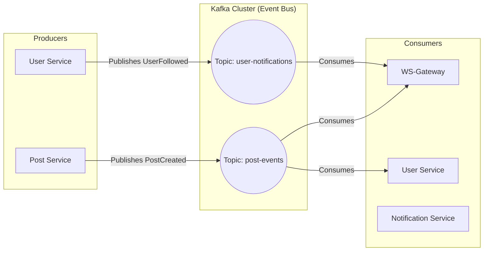

# 📨 Event-Driven Infrastructure: Apache Kafka

Wordium utilizes **Apache Kafka** as its central message broker to implement an **Event-Driven Architecture (EDA)**. This decouples our microservices, ensuring high availability and system resilience.

## 🧠 Why Kafka? (Architectural Decision)

Instead of using synchronous REST calls between services (which causes "Distributed Monolith" issues), we use Kafka to:

1. **Decouple Services:** The `Post-Service` doesn't need to know if the `Notification-Service` is online to function.
2. **Ensure Data Consistency:** Events are persisted in Kafka, allowing services to "catch up" if they go offline.
3. **Scalability:** We can scale consumers (e.g., multiple instances of `User-Service`) to handle high event volumes.

---

## 🏗️ Topology Diagram



---

## 🛠️ Infrastructure Configuration

We use the **Confluent Platform (v7.5.0)** distribution for enterprise-grade stability.

### Broker Details

- **Zookeeper:** Handles controller election and cluster metadata.
- **Kafka Broker:** Handles log storage and client communication.
- **Internal Port:** `29092` (Used for Service-to-Service communication inside Docker).
- **External Port:** `9092` (Used for host machine debugging/tools like Kafdrop).

### Environment Variables Logic

| Key | Value | Purpose |
| :--- | :--- | :--- |
| `KAFKA_ADVERTISED_LISTENERS` | `INTERNAL://kafka:29092...` | Directs internal traffic through the Docker bridge. |
| `KAFKA_OFFSETS_TOPIC_REPLICATION_FACTOR` | `1` | Optimized for development/single-node cluster. |

---

## 📋 Defined Topics & Schema

| Topic Name | Producer | Consumer(s) | Payload Description |
| :--- | :--- | :--- | :--- |
| `post.created` | `Post-Service` | `WS-Gateway`, `User-Service` | Trigger real-time alerts and update user post-count metrics. |
| `user.auth.signup` | `Auth-Service` | `User-Service` | Triggers the creation of a profile profile once auth is confirmed. |
| `notification.broadcast` | `WS-Gateway` | All Active Clients | System-wide announcements via WebSockets. |

---

## 🚀 How to Monitor & Debug

To verify that the messaging system is healthy:

1. **Check Container Logs:**

    ```bash
    docker logs -f kafka
    ```

2. **Test Connectivity (from inside a container):**

    ```bash
    # List all topics
    kafka-topics --bootstrap-server localhost:9092 --list
    ```

3. **Consume Events manually:**

    ```bash
    kafka-console-consumer --bootstrap-server localhost:9092 --topic post.created --from-beginning
    ```

---

## 🛡️ Resilience Strategy

- **Idempotent Consumers:** Every consumer in Wordium is designed to handle the same message twice without side effects (preventing duplicate posts/notifications).
- **Retries:** We implement exponential backoff on consumers to handle transient database failures.
